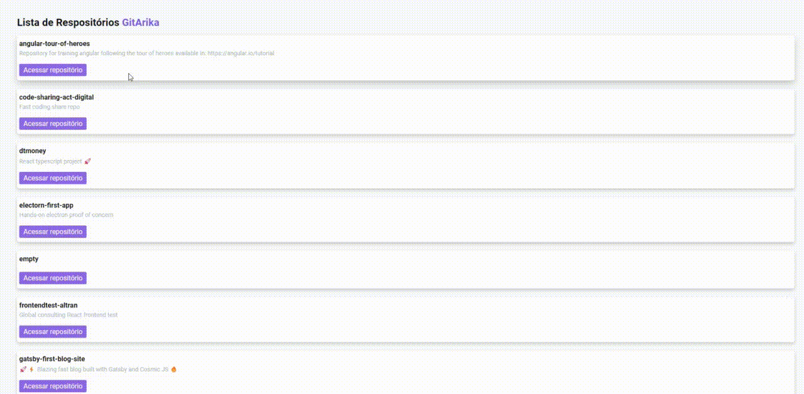

# About

This is a fundamentals React project.

The app was created hands-on and all dependencies are installed manually.

Tha app fetch and render a list of repositories from github public API.

# Live Project



# Scripts

```
yarn dev - starts a development server your application
```

```
yarn build - build your application with production settings
```

# Technologys

- React
- React Dom
- Sass
- Webpack (including manually setup plugins )
- Babel

# Credits

Application built on React ignite from Rocketseat.
